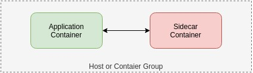

#  The Sidecar Pattern

**Two containers:**
- application container
- sidecar container

**The role of the sidecar:**
- extends / improve the application container, often without the application container’s knowledge.

**Containers...**
- live in the same machine via an atomic container group (example: the pod in Kubernetes).
- share resources (example: parts of the filesystem, hostname and network)

**Advantages:**

- Modularity
- Reuse of components
  - Reduces code duplication in a microservice architecture (as you can reuse component)
- Reduces the complexity
- Container can evolve independently
  - they can be independently updated
  - they can be implemented in different languages

## Examples

- add HTTPS to a Legacy Service
  - the sidecar act like a proxy
- watchdog
- configuration synchronization
- plateform abstration

