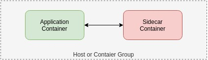

#  The Sidecar Pattern

**Two containers:**
- application container
- sidecar container

**The role of the sidecar:**
- augment / improve the application container, often without the application container’s knowledge.

**Containers...**
- live in the same machine via an atomic container group (ex. the pod in Kubernetes).
- share resources (ex parts of the filesystem, hostname and network

