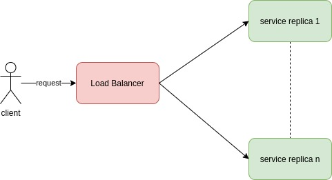

#  Replicated Load-Balanced Services

A service is replicated: every service is identical and they are behind a load balancer.

Strategies for the load balancer:
- round-robin
- session stickiness
- implement a probe to check replication availabilities
- a more complex approach

## Stateless Services

Each service replica doesn't need a saved state: each request can be rooted to any service replica.

Replication of this type of service provide **redundancy and scalability**.

Redundancy let to:
- provide a service level agreement for your system

Scalability let to:
- increase the number of request being processes by the system.
- decrease the resources used by the system

arrivato a:
Readiness Probes for Load Balancing

<!--
## The role of the Ambassador:

- **broker communication coming from the application container to the rest of the world.**

In other words:
- the ambassador container sends network requests on behalf of the application container

**Containers...**

This is a specialization patter of the sidecar pattern.
The containers:
- live in the same machine via an atomic container group (example: the pod in Kubernetes).
- share resources (example: parts of the filesystem, hostname and network)

## Advantages:

From the sidecar pattern:
- Modularity
- Reuse of components
  - Reduces code duplication in a microservice architecture (as you can reuse component)
- Reduces the complexity
- Container can evolve independently
  - they can be independently updated
  - they can be implemented in different languages

Besides:
- separation of concerns

## Examples:

- a proxy for a sharded service
- beta testing (the ambassador carry the logic to redirect requests prod or beta)
- Service Brokering (service broker do services discovering and act as a proxy)

 -->
