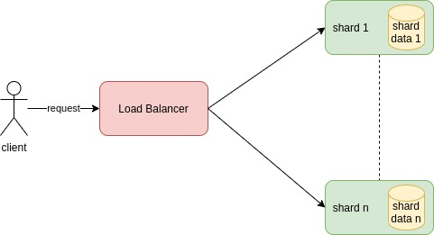

#  Sharded Services

Each service, called *shard*, can serve only a subset of the possible requests.
A load balancing node, also called *shard manager*, must be able to distribute the request to the right shard.

This type of replication is used scale a service on the size og the state needed by the service.
In other word, it's useful when data to be managed is too much to be handled by one single service.

